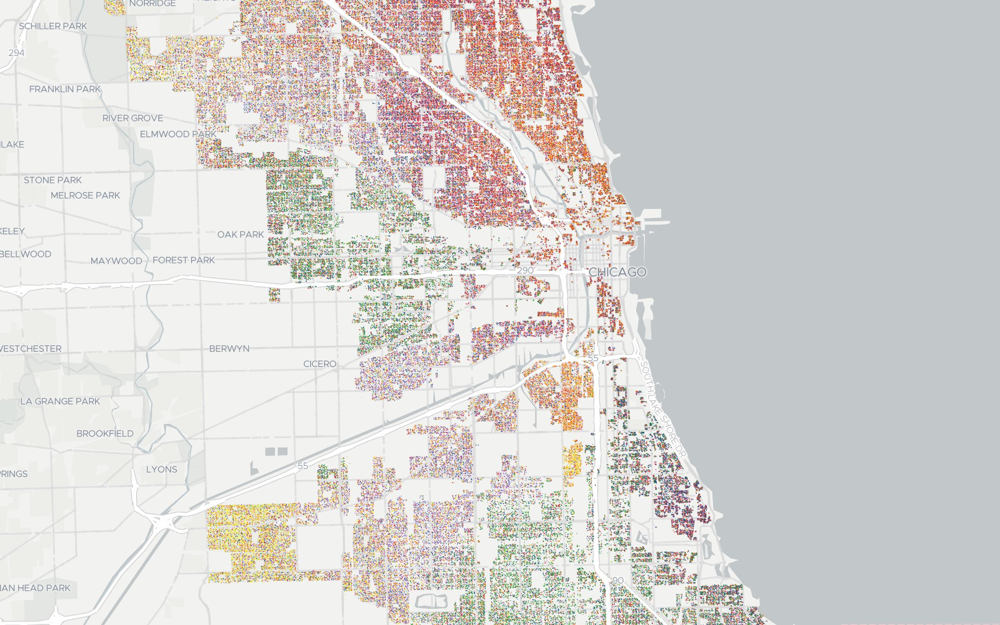
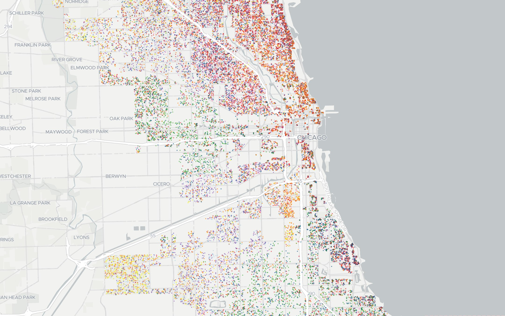

# Chicago 2019 Election Dot Density

Map of all votes in the 2019 Chicago mayoral primary by precinct, randomly assigned to a point inside a residential parcel within the precinct using Conveyal's [`aggregate-disser` tool](https://github.com/conveyal/aggregate-disser).

## Setup

Requires `tippecanoe`, `pyesridump`, `mapshaper` and `wget`.

```bash
make all
```

### All Points

1 point = 1 vote



### Sampled Points

1 point = 100 votes


